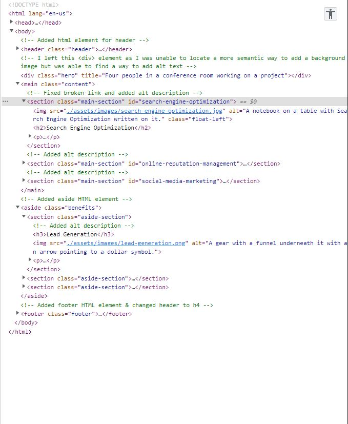

# Horiseon Social Solutions and Accessibility

## Description

Refactoring Horiseon starter code to add semantic HTML elements and improve the CSS code to improve the webpage SEO and most importantly improve web accessibility to ensure anyone who is visiting this webpage with assitive technologies can do so as seamlessly as possible.

## Installation

N/A

## Useage

This webpage focuses on social solutions for growing businesses. By using semantic HTML to improve our code, we are being inclusive to those who use assistive technologies to browse the internet and allowing those technologies to communicate the webpage effectively to them. Semantic HTML will also give the webpage better SEO or Search Engine Optimization to give more visibility to the page. The screenshot below shows the accessibility tree in the DevTools which allows us to see the accessibility properties of our page.

 

## Link To Deployed Webpage:

[Horiseon Social Solutions Website](https://isabella-pettini.github.io/horiseon-social-solutions/)

## Future Development 
In the future targeting the low contrast on the page and tuning that to better meet accessibility standards. 

## Credits
N/A

## License
Please refer to the LICENSE in the repo. 