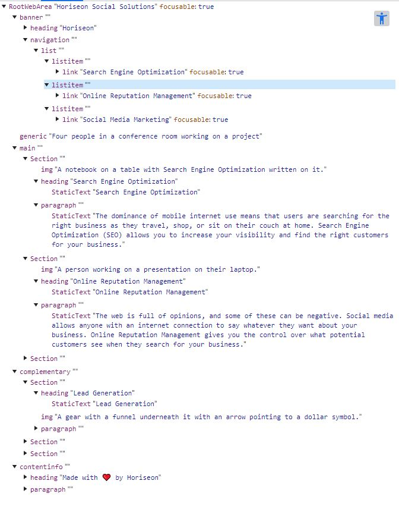

# Horiseon Social Solutions and Accessibility

## Description

Refactoring this code to add semantic HTML to improve the webpage SEO and most importantly improve web accessibility to ensure anyone who is visiting this webpage with assitive technologies can do so as seamlessly as possible.

## Installation

N/A

## Useage

This webpage focuses on Search Engine Optimization, Online Reputation Management and Social Media Marketing. These sections give a brief description of the topic. By using semantic HTML to improve the code we are being inclusive to those who use assistive technologies to browse the internet and allowing those technologies to communicate the webpage effectively to them. Semantic HTML will also give the webpage better SEO or Search Engine Optimization. As seen in the screenshot below or by accessing the DevTools in the web browser, we can see that by using semantic HTML we're adding more effective communication in our code to better assist users.

[Horiseon Social Solutions Website](https://isabella-pettini.github.io/horiseon-social-solutions/)

## Credits
N/A

## License
Please refer to the LICENSE in the repo. 